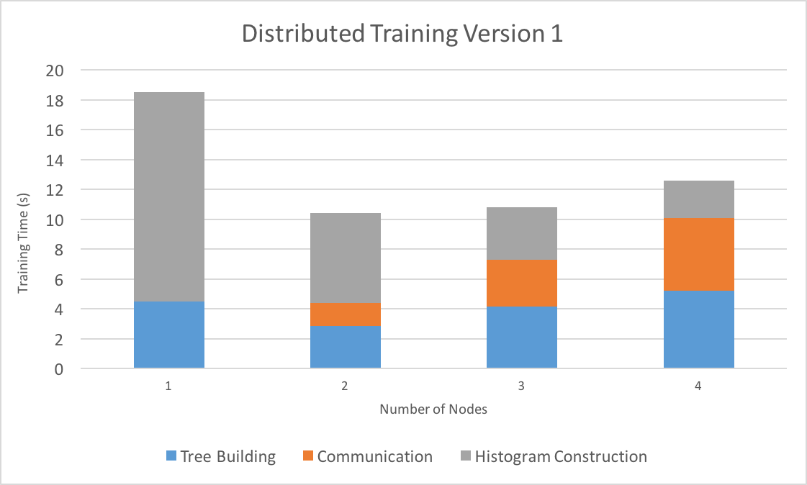

# Distributed Decision Trees with Heterogeneous Parallelism

Alex Xiao (axiao@andrew.cmu.edu)

Rui Peng (ruip@andrew.cmu.edu)

* [link to proposal](proposal.html)
* [link to checkpoint](checkpoint.html)

## WORK IN PROGRESS STILL

## Summary

Decision tree learning is one of the most popular supervised classification
algorithms used in machine learning. In our project, we attempted to optimize decision tree learning
by parallelizing training on a single machine (using multi-core CPU parallelism, GPU parallelism, and a hybrid of the two) and
across multiple machines in a cluster. Initial results show performance gains from all forms of parallelism.
Our hybrid, single machine implementation on GHC achieves an under 9 second training
time for a dataset with over 11 million samples, which is
53 times faster than sci-kit learn with similar accuracy.

## Challenges

* Building an optimized sequential implementation of decision tree learning to use as
  a baseline requires some work, since the default decision tree training algorithm
  is slow and requires repeatedly sorting the dataset, which can be massive.

* Parallelizing training with a machine on CPU cores is also tricky, since the
  shape of the decision tree is irregular and determined at runtime, making
  static partitioning of the workload across tree nodes ineffective.

* Distributing training across machines in a cluster requires significant
  communication between machines, since the decision on which feature to split
  on requires a global view of the dataset.

* The standard algorithm for decision tree learning does not translate well to GPU or
  hybrid implementations. To quote the creator of XGBoost, a widely used decision tree
  boosting framework: “The execution pattern of decision tree training relies heavily
  on conditional branches and thus has high ratio of divergent execution,
  which makes the algorithm have less benefit from SPMD architecture”. Our
  implementation of decision tree learning must not have the same problems.

* Scheduling GPU and CPU computation on a heterogenous machine is difficult,
  since it is crucial to identify scenarios in which one is preferred over
  the other or if the overhead of using both is worth the trouble.

## Optimizing a Sequential Implementation

The standard sequential implementation for decision tree learning looks
something like this:

<pre>
while (!work_queue.empty()) {
  node = work_queue.remove_head()

  if (node.is_terminal()) continue

  best_split_point = nil

  for f in features {
    sort(node.data, comparator = f)

    for d in node.data {
      check_best_split_point(best_split_point,f,d)
    }
  }

  left,right = split(node, best_split_point)

  work_queue.add(left)
  work_queue.add(right)

}
</pre>

Since decision trees are created by splitting on feature values, sorting the
data is required to efficiently compute distribution statistics of
the data while scanning through data in the inner loop. The repeated sorting of
data makes this algorithm slow.

To improve upon this, we implemented an algorithm that first builds a
histogram of every feature that roughly captures the distribution statistics
of the data. Using this algorithm, training roughly looks like this:

<pre>
build_histograms()

while (!work_queue.empty()) {
  node = work_queue.remove_head()

  if (node.is_terminal()) continue

  best_split_point = nil

  for f in features {
    for bin in node.histogram(f) {
      check_best_split_point(best_split_point,f,bin)
    }
  }

  left,right = split(node, best_split_point)

  left.compute_histograms(node.histogram, best_split_point)
  right.compute_histograms(node.histogram, best_split_point)

  work_queue.add(left)
  work_queue.add(right)

}
</pre>

This eliminates sorting the data and also scans over histogram
bins instead of data points. Since number of bins (set to a constant value like
255) <<<< number of datapoints, this provides a big performance gain. The main
computation is now offloaded to building the initial histograms and constructing new
histograms from old histograms. To do this efficiently, we use an adaptive
histogram construction algorithm from this
[paper](https://www.microsoft.com/en-us/research/wp-content/uploads/2016/02/boosttreerank.pdf) and compute the left/right
child histograms by first computing the smaller one, then performing histogram
subtraction to get the larger one.

Below are performance comparisons between our implementation of the
above two algorithms and the popular decision tree learning framework sci-kit learn.
We benchmarked on the [Microsoft Learn to
Rank](https://www.microsoft.com/en-us/research/project/mslr/) dataset, which contains 2
million (query,url) pairs, each with 136 features and a label denoting
the relevance of the query to the url.

Note that although our accuracy has also decreased slightly due to the approximate
nature of our histogram binning, the reduction is small (on the order of 0.1)
and not much of a concern if we used our algorithm in an ensemble method (which
people often do with decision trees). Furthermore, since our focus is on
performance, we decided to not spend too
much time on sophisticated splitting heuristics and pruning techniques that are found in mature
frameworks as long as our accuracy is competitive.

## Parallelizing with Multiple CPU Cores

As mentioned previously parallelizing across tree nodes leads to the problem of
an imbalanced workload. After profiling our code, we determined two
computationally expensive areas:

1. Initial building of histograms.
2. Constructing child histograms from each node.

We used OpenMP to parallelize these two areas across features. Since building
histograms and constructing child histograms requires scanning over
the distributions of every histogram bin of every feature, this leads to a
roughly balanced workload. The speedup graphs are shown below.

Explain speedup graphs here.

The speedup graph above at first displays near-linear speedup, especially for
histogram construction across different features. We suspect that the eventual
dissipation of speedup is due to memory bandwidth issues since constructing
child histograms has very little arithmetic intensity.

## Distributing Training with Multiple Machines

A major concern we had initially, communication efficiency of distributed
training, is somewhat alleviated by our histogram representation of the dataset.
This allows multiple machines to communicate with histograms instead of
their partition of the dataset, drastically reducing the communication
requirements.

Our distributed training algorithm is basically to assign each machine on latedays
to have a partition of the dataset, and construct local histograms. Whenever
we decide how to split a tree node, the machines send their histograms to the
root machine, which merges them together to search for a split point. The root
machine then sends the split point to the other machines, and each machine
builds local child histograms individually.
Initial results, however, show that communication efficiency
is still a problem. The experiement below was run on the latedays cluster on a
varying number of machines.

As you can see from the graph, histogram construction scales well due to the
trivial communication requirements necessary for it. On the other hand,
communication during tree building is expensive, since the root
machine must communicate with all other machines on every node split for every
feature. We plan to further optimize our distributed training
code by reducing the amount of information each machine needs to send to
the root by performing some local computation first.

## GPU and Hybrid Implementation

Another advantage of our histogram implementation is that the main bottleneck during
tree construction is computing child histograms, which requires a lot of moving
data around and incrementing counters in memory. This kind of computation lends
itself well to a GPU implementation. The initial histogram construction phase,
however, cannot be implemented efficiently on GPU due to the divergent exeuction
pattern of the adaptive histogram building algorithm. This motivates a hybrid
algorithm: build the inital histograms using multi-threaded CPU, and
use both the GPU and CPU to accelerate child histogram computation. Furthermore,
since the speedup graph for CPU suggests that our algorithm may be bandwidth
bound, an implementation that uses both the memory bandwidth of GPU and CPU will
likely be faster.
Initial results show that hybrid reduces tree building time by 20% over GPU only and
CPU only when running on a massive dataset with 11 million samples, but we are working on
optimizing this further.

## Further Work

We have two main goals to focus on:

1. Improve our GPU implementation and hybrid scheduling. Currently the GPU
   implementation is pretty simple, which might make hybrid scheduling
   not as effective as it could be. We would
   like to look into further improving the GPU implemntation to show the
   advantages of hybrid scheduling. Specifically, we are planning to reduce
   the memory movement between host and device that occurs when training.
2. Improve the communication efficiency of our distributed implementation. We
   found a
   [paper](https://www.google.com/search?q=communication+efficient+decision+tree+learning&oq=communication+efficient+decision+tree+learning&aqs=chrome..69i57j69i60j0.4052j0j4&sourceid=chrome&ie=UTF-8) recently published at NIPS that will help us in this regard.
   We hope that implementing their idea will allow us to scale beyond two
   machines.
