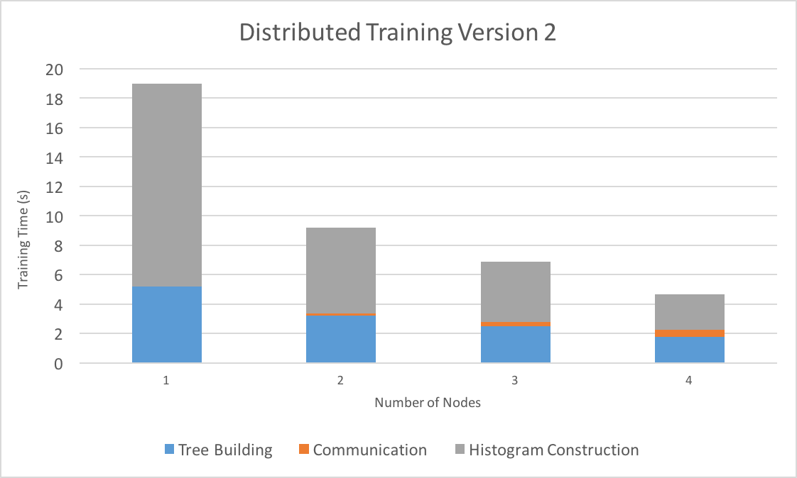

# Distributed Decision Trees with Heterogeneous Parallelism

Alex Xiao (axiao@andrew.cmu.edu)

Rui Peng (ruip@andrew.cmu.edu)

* [link to proposal](proposal.html)
* [link to checkpoint](checkpoint.html)
* [link to code](https://github.com/raypeng/DGBDT)

# Final Report

## Summary

Decision tree learning is one of the most popular supervised classification
algorithms used in machine learning. In our project, we attempted to optimize decision tree learning
by parallelizing training on a single machine (using multi-core CPU parallelism, GPU parallelism, and a hybrid of the two) and
across multiple machines in a cluster. Initial results show performance gains from all forms of parallelism.
In particular, our hybrid, single machine implementation on GHC achieves an 8 second training
time for a [dataset](https://archive.ics.uci.edu/ml/datasets/HIGGS) with over 11 million samples, which is
**60 times faster** than sci-kit learn and **24 times faster** than our optimized
sequential version, with similar accuracy.

## Background

### Decision Tree Basics

Decision trees are a common model used in machine learning and data mining to approximate regression or classification functions.
They model functions of the form:

 

 

Where x1 through xp are the features of the input and y is the output.

A decision tree models this function with a series of queries of the form "xi > v?", where v is a value of the feature.
For example, below is an example of a decision tree used to predict whether or not a
passenger survived the Titanic, based on the features gender, age, and
number of siblings/spouses.

 

 

For the purposes of this project, we will focus on classification decision
trees, where we are trying to predict the class label of an input, such as in the example above.

### Building the Decision Tree

Decision tree training algorithms learn by
training on examples in the form of
(x1,x2,...,xn,y).
While building the tree, decision tree training algorithms would need to create
nodes that represent a query of the form "xi > v?". The root node initially
contains all of the data, and when the decision tree chooses the query, or
the split point, the data is partitioned into left and right
children. This process repeats until the tree has sufficient size, and
the class label assigned to the leaves of the tree can simply be the majority class label
of the data assigned to the leaf.

Typically the most computationally expensive portion of this process is evaluating the potential split
points for each feature. The evaluation for a split point is usually based on some kind of metric that captures the
distribution of the class labels of the data after the split.
For example, a common criteria to use is the minimum
weighted entropy of the children nodes, which is defined below. Sl is the size
of left child's data partition and plj is the fraction of the left child's
data partition that has class label j. Variables for the right child are defined
similarly.

 

 

When the feature values are continuous, it is more efficient to compute this weighted sum
for each split point by first sorting the values based on each feature and scanning
through the sorted list. This way we can maintain the left and right
distributions of the class labels and evaluate all split points for a feature in
one scan. Below is pseudo-code for how a decision tree training algorithm that achieves this.

<pre>

// root contains all the data
work_queue.add(root)

while (!work_queue.empty()) {
  node = work_queue.remove_head()

  if (node.is_terminal()) continue

  best_split_point = nil

  for f in features {
    sort(node.data, comparator = f)

    left_distribution = empty()
    right_distribution = node.get_distribution()

    for d in node.data {
      // check this split point based off some criteria, like entropy
      criteria = eval(left_distribution,right_distribution)

      best_split_point = upate_best_split_point(criteria, best_split_point)
      update_distributions(left_distribution, right_distribution, d);
    }
  }

  // partition data based on split point
  left,right = split(node, best_split_point)

  work_queue.add(left)
  work_queue.add(right)
}
</pre>

### A Faster Sequential Algorithm

Unfortunately, the standard decision tree construction algorithm is slow even for
sequential standards, since repeated sorting of data becomes a bottleneck. One common
optimization for this is to first preprocess the dataset by constructing
a histogram for each feature to compactly describe the distribution of the data.

 

 

With these histograms, sorting is no longer necessary. Below is pseudo-code
of how to leverage the histogram binning technique.

<pre>

root.histograms = construct_histograms()
work_queue.add(root);

while (!work_queue.empty()) {
  node = work_queue.remove_head()

  if (node.is_terminal()) continue

  best_split_point = nil

  for f in features {
    left_distribution = empty()
    right_distribution = node.get_distribution()

    for bin in node.histograms(f) {

      // check this split point based off some criteria, like entropy
      criteria = eval(left_distribution,right_distribution)

      best_split_point = upate_best_split_point(criteria, best_split_point)
      update_distributions(left_distribution, right_distribution, bin);
    }
  }

  left,right = split(node, best_split_point)
  left.compute_histograms(node.histogram, best_split_point)
  right.compute_histograms(node.histogram, best_split_point)

  work_queue.add(left)
  work_queue.add(right)
}
</pre>

This eliminates sorting the data and also scans over histogram
bins instead of data points. Since number of bins (set to a constant value like
255) <<<< number of datapoints, this should provide a big performance when
searching for split points. The main computation is now offloaded to building the initial
histograms and constructing new histograms from old histograms. Our efforts in
this project were to use parallelism to accelerate these two parts.
Specifically, we were interested to see how fast we could make this algorithm
by using all the different computational resources available here to us at CMU,
which include multi-core CPUs, GPUs, and a distributed cluster.

### Challenges

To summarize, these are the challenges we face in this project:

* Building an optimized sequential implementation of decision tree learning to use as
  a baseline requires some work, since the default decision tree training algorithm
  is slow and requires repeatedly sorting the dataset, which can be massive.

* Parallelizing training with a machine on CPU cores is also tricky, since the
  shape of the decision tree is irregular and determined at runtime, making
  static partitioning of the workload across tree nodes ineffective.

* Distributing training across machines in a cluster requires significant
  communication between machines, since the decision on which feature to split
  on requires a global view of the dataset.

* The standard algorithm for decision tree learning does not translate well to GPU or
  hybrid implementations. To quote the creator of XGBoost, a widely used decision tree
  boosting framework: “The execution pattern of decision tree training relies heavily
  on conditional branches and thus has high ratio of divergent execution,
  which makes the algorithm have less benefit from SPMD architecture”. Our
  implementation of decision tree learning must not have the same problems.

* Scheduling GPU and CPU computation on a heterogenous machine is difficult,
  since it is crucial to identify scenarios in which one is preferred over
  the other or if the overhead of using both is worth the trouble.

## Approaches and Results

As we seek to optimize the performance of the algorithm using all the techniques
we learned in class and leveraging different computing hardware, we describe our
approaches and results for individual optimizations.

### Optimizing a Sequential Implementation

### Approach

We first implemented the naive, sorting based implementation for decision tree
training. After some intial profiling, we then implemented the histogram-based
algorithm mentioned above.

To construct the initial histogram bins efficiently, we implemented an
adaptive histogram construction algorithm based on this
[paper](https://www.microsoft.com/en-us/research/wp-content/uploads/2016/02/boosttreerank.pdf).
We also optimized the histogram splitting phase by
only reconstructing the smaller child's histograms when we split a node.
The larger child's histogram can then be quickly constructed from its
parent's and its sibling's histograms through histogram subtraction.

#### Result

Below are performance comparisons between our implementations of the
sorting-based algorithm and the histogram-based algorithm. We
also compare our performance with a popular framework used for
decision tree training: scikit-learn.
We benchmarked on the [Microsoft Learn to
Rank](https://www.microsoft.com/en-us/research/project/mslr/) dataset, which contains 2
million (query,url) pairs, each with 136 features and a label denoting
the relevance of the query to the url. Experiments were performed on GHC.
We set the maximum number of leaves in the decision tree to be 255, which
is consistent with all experiements listed on this page.

Our final sequential version observes massive improvements over both scikit-learn and
the traditional decision tree learning algorithm, for the reasons mentioned in Background.
This is the optimized sequential version we will use as a baseline later. Note that although
our accuracy has also decreased slightly due to the approximate
nature of our histogram binning, the reduction is small (around 0.05%)
and not much of a concern if we used our algorithm in an ensemble method (which
people often do with decision trees). Furthermore, since our focus is on
performance, we decided to not spend too much time on sophisticated splitting
heuristics and pruning techniques that are found in mature frameworks as long as our accuracy
is competitive.

### Parallelizing with Multiple CPU Cores

#### Approach

As mentioned previously parallelizing across tree nodes likely leads to the
problem of an imbalanced workload with a static partitioning or too much overhead
with a dynamic partitioning. So instead we decided to parallelize
the decision tree training algorithm within a single tree node, specifically for
the two expensive areas as mentioned previously:

1. Initial building of histograms.
2. Splitting parent histograms into child histograms.

We used OpenMP to parallelize these two areas across features. Since building
histograms and constructing child histograms requires scanning over
the distributions of every histogram bin of every feature, this leads to a
roughly balanced workload. The graph below shows the training times of this
parallel algorithm run on different numbers of threads. Experiments were
performed on GHC and the Microsft Learn to Rank dataset.

##### Result

The graph above at first displays near-linear speedup, especially for
histogram construction across different features. We suspect that the eventual
dissipation of speedup is very likely due to memory bandwidth issues, since
histogram construction is trivially parallelizable across features and needs
minimal synchronization. To solve this problem, we decided to utilize more
resources available to use here at CMU, specifically via distributed training and
GPU/hybrid training.

### Distributing Training with Multiple Machines

#### Approach

A major concern we had initially, communication efficiency of distributed
training, is somewhat alleviated by our histogram representation of the dataset.
This allows multiple machines to communicate with histograms instead of
their partition of the dataset, drastically reducing the communication
requirements.

Our first distributed algorithm roughly works as follows:

1. Each machine in the cluster is assigned a partition of the dataset. One machine is
   designated as the master which will be responsible for evaluating split
   points.

2. Each machine initially constructs local histograms of their partition and
   assigns their local root node the histograms like before.

3. While there are still nodes to be split, each worker sends their local
   histograms for each feature for that node to master. Master
   merges these histograms and evaluates possible split points like before.

4. Master sends the best split point to the workers. Each machine in parallel
   now splits the node into left and right childs. Repeat steps 3 and 4 as
   needed.

The parallelism that we gain from this algorithm is that each machine can
construct and maintain histograms for their partition in parallel. Evaluating
possible split points accurately, however, requires a global view of the
feature distributions and as a result master needs all the histograms to make
a decision. This could result in high communication overhead, since every
node we split in the decision tree would require this information exchange.

Our second distributed algorithm attempted to fix this problem by minimizing
communication efficiency through an algorithm recently published in a [paper at
NIPS](https://arxiv.org/abs/1611.01276). The idea is to maximize local
computations on each worker before communicating with master. The algorithm is
now roughly as follows (steps 1 and 2 same as before):

3. While there are still nodes to be split, each worker first uses their local
   histogram to evaluate possible split points.

4. Each worker votes for their top k features, where k is a configurable
   parameter.

5. Master aggregates the votes and requests the top 2k most voted features.

6. Workers send their local histograms for the top 2k features to master.
   Master merges these histograms and evaluates possible split points like before.

7. Master sends the best split point to the workers. Each machine in parallel
   now splits the node into left and right childs. Repeat steps 3 to 7 as
   needed.

We implemented the above algorithms with Open MPI for communication
between master and worker and OpenMP for parallelism within a machine
like before.

#### Result

We evaluated the two algorithms on the Latedays cluster with a varying number of
nodes.

### GPU and Hybrid Implementation

#### Approach

Another advantage of our histogram implementation is that the main bottleneck during
tree construction is computing child histograms, which requires a lot of moving
data around and incrementing counters in memory. This kind of computation lends
itself well to a GPU implementation. This also motivates a hybrid
algorithm: build the initial histograms using multi-threaded CPU (getting
GPU to work for adapative histogram building will take some work), and
use both the GPU and CPU to accelerate child histogram computation (pseudo-code
below):

<pre>
gpu_features, cpu_features = assign_features(features)
gpu_result = []
cpu_result = []

// Asynchronously compute on gpu
kernel_gpu_compute_histograms(gpu_features, gpu_result)

cpu_compute_histograms(cpu_features, cpu_result)

cudaThreadSynchronize()

merge_results(gpu_result, cpu_result)
</pre>

Since the speedup graph for CPU suggests that our algorithm may be bandwidth
bound, an implementation that uses both the memory bandwidth of GPU and CPU will
likely be faster. We foundhybrid reduces tree building time by 10%
over GPU only by statically assigning 8 features to threads on CPU and the rest
on GPU on the [HIGGS Data Set](https://archive.ics.uci.edu/ml/datasets/HIGGS),
which has 11 million samples. Both the GPU only and hybrid only implemetation
are improvements over a multi-core CPU implementation with 16 threads.

We have also experimented with a dynamic work scheduling policies in which we choose
GPU/CPU hybrid for nodes with more samples and CPU-only for nodes with fewer samples
(much like choosing between top-down and bottom-up in hybrid BFS in assignment 3).
This dynamic scheduling tries to minimize data transfer between GPU and CPU in cases
where the doing work on GPU is not worth the data transfer overhead.

#### Result

With this scheme, the dynamic hybrid version out performs GPU-only and CPU-only version
by a noticable margin. We find the initial cuda memory setup time takes up 25% of total
tree construction time which makes the drags GPU-only total runtime down to the same as CPU-only. This indicates
that to find a good hybrid scheduling strategy, we need to carefully profile the code
and placing the work optimally on GPU and CPU depending on specific workload conditions.
If we had more time for the project, we would perform a more comprehensive profiling and
devise an optimal dynamic scheduling policy.

## References

**Picture sources:**

[https://upload.wikimedia.org/wikipedia/commons/f/f3/CART_tree_titanic_survivors.png](https://upload.wikimedia.org/wikipedia/commons/f/f3/CART_tree_titanic_survivors.png)

**Papers:**

Learning to Rank Using Classification and Gradient Boosting

[https://www.microsoft.com/en-us/research/wp-content/uploads/2016/02/boosttreerank.pdf](https://www.microsoft.com/en-us/research/wp-content/uploads/2016/02/boosttreerank.pdf)

A Communication-Efficient Parallel Algorithm for Decision Tree

[https://arxiv.org/abs/1611.01276](https://arxiv.org/abs/1611.01276)

**Datasets:**

HIGGS Classification Dataset

[https://archive.ics.uci.edu/ml/datasets/HIGGS](https://archive.ics.uci.edu/ml/datasets/HIGGS)

Microsoft Learning to Rank Dataset

[https://www.microsoft.com/en-us/research/project/mslr/](https://www.microsoft.com/en-us/research/project/mslr/)

**Libraries for Benchmarking:**

Decision Trees Module in scikit-learn

[http://scikit-learn.org/stable/modules/tree.html](http://scikit-learn.org/stable/modules/tree.html)
