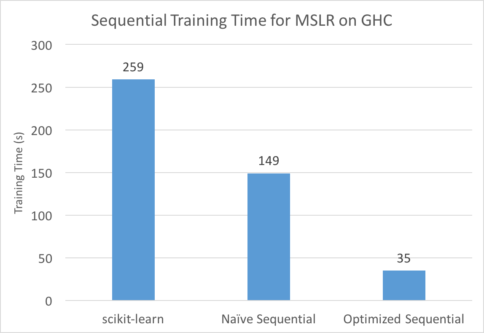

# Distributed Decision Trees with Heterogeneous Parallelism

Alex Xiao (axiao@andrew.cmu.edu)

Rui Peng (ruip@andrew.cmu.edu)

* [link to proposal](proposal.html)
* [link to checkpoint](checkpoint.html)
* [link to code](https://github.com/raypeng/DGBDT)

# Final Report

## Summary

Decision tree learning is one of the most popular supervised classification
algorithms used in machine learning. In our project, we attempted to optimize decision tree learning
by parallelizing training on a single machine (using multi-core CPU parallelism, GPU parallelism, and a hybrid of the two) and
across multiple machines in a cluster. Initial results show performance gains from all forms of parallelism.
In particular, our hybrid, single machine implementation on GHC achieves an 8 second training
time for a [dataset](https://archive.ics.uci.edu/ml/datasets/HIGGS) with over 11 million samples, which is
**60 times faster** than sci-kit learn and **24 times faster** than our optimized
sequential version, with similar accuracy.

## Background

Decision trees are a common model used in machine learning and data mining to approximate regression or classification functions. They take an input with a set of features and predict the corresponding label or value by using the nodes of the tree to split on the features. For example, below is an example of a decision tree used to assign a prediction score to whether or not a person likes computer games, based on the features "age" and "gender".

 

 

For the purposes of this project, we will focus on classification decision
trees, where we are trying to predict the class label of an input, such as in
the example above.

## Background

While building the tree, decision tree training algorithms would need to
evaluate potential split points in the form of "feature f > x?" for each node.
The data will then be partitioned on that split point and repeat this process until the
tree becomes large enough. The evaluation for a split point is usually based on some kind of metric that captures the distribution of the class labels of the data after the split.
For example, a common method is to minimize the weighted entropy of the data
after splitting the node, where entropy is defined as the expected amount of information
with respect to the class labels, defined below for when there are J class labels.

When the feature values are continuous, it is more efficient to compute the term
above for each split point by first sorting the feature values and scanning
through the sorted list. This way we can maintain the left and right
distributions of the class labels and evaluate all split points for a feature.
Below is pseudo-code for a (binary) decision tree training algorithm that achieves this.

<pre>

// root contains all the data
work_queue.add(root)

while (!work_queue.empty()) {
  node = work_queue.remove_head()

  if (node.is_terminal()) continue

  best_split_point = nil

  for f in features {
    sort(node.data, comparator = f)

    for d in node.data {
      // check this split point based off some criteria, like entropy
      check_best_split_point(best_split_point,f,d)
    }
  }

  // partition data based on split point
  left,right = split(node, best_split_point)

  work_queue.add(left)
  work_queue.add(right)
}
</pre>

Since decision trees are created by splitting on feature values, which
can often be continuous numbers, sorting the
data is required to efficiently compute distribution statistics of
the split while scanning through data in the inner loop. Unfortunately,
the standard decision tree construction algorithm is slow even for sequential
standards, since repeated sorting of data becomes a bottleneck. One common
optimization for this is to first preprocess the dataset by constructing
histograms to compactly describe the distribution of the data for each feature.

For example, consider the image below showing the datapoints ordered by some
feature. Instead of

### Challenges

* Building an optimized sequential implementation of decision tree learning to use as
  a baseline requires some work, since the default decision tree training algorithm
  is slow and requires repeatedly sorting the dataset, which can be massive.

* Parallelizing training with a machine on CPU cores is also tricky, since the
  shape of the decision tree is irregular and determined at runtime, making
  static partitioning of the workload across tree nodes ineffective.

* Distributing training across machines in a cluster requires significant
  communication between machines, since the decision on which feature to split
  on requires a global view of the dataset.

* The standard algorithm for decision tree learning does not translate well to GPU or
  hybrid implementations. To quote the creator of XGBoost, a widely used decision tree
  boosting framework: “The execution pattern of decision tree training relies heavily
  on conditional branches and thus has high ratio of divergent execution,
  which makes the algorithm have less benefit from SPMD architecture”. Our
  implementation of decision tree learning must not have the same problems.

* Scheduling GPU and CPU computation on a heterogenous machine is difficult,
  since it is crucial to identify scenarios in which one is preferred over
  the other or if the overhead of using both is worth the trouble.

## Optimizing a Sequential Implementation

The standard sequential implementation for decision tree learning looks
something like this:

To improve upon this, we implemented an algorithm that first builds a
histogram of every feature that roughly captures the distribution statistics
of the data. Using this algorithm, training roughly looks like this:

<pre>
build_histograms()

while (!work_queue.empty()) {
  node = work_queue.remove_head()

  if (node.is_terminal()) continue

  best_split_point = nil

  for f in features {
    for bin in node.histogram(f) {
      check_best_split_point(best_split_point,f,bin)
    }
  }

  left,right = split(node, best_split_point)

  left.compute_histograms(node.histogram, best_split_point)
  right.compute_histograms(node.histogram, best_split_point)

  work_queue.add(left)
  work_queue.add(right)

}
</pre>

This eliminates sorting the data and also scans over histogram
bins instead of data points. Since number of bins (set to a constant value like
255) <<<< number of datapoints, this provides a big performance gain. The main
computation is now offloaded to building the initial histograms and constructing new
histograms from old histograms. To do this efficiently, we use an adaptive
histogram construction algorithm from this
[paper](https://www.microsoft.com/en-us/research/wp-content/uploads/2016/02/boosttreerank.pdf) and compute the left/right
child histograms by first computing the smaller one, then performing histogram
subtraction to get the larger one.

### Result

Below are performance comparisons between our implementation of the
above two algorithms and the popular decision tree learning framework sci-kit learn.
We benchmarked on the [Microsoft Learn to
Rank](https://www.microsoft.com/en-us/research/project/mslr/) dataset, which contains 2
million (query,url) pairs, each with 136 features and a label denoting
the relevance of the query to the url. Experiments were performed on GHC.

Our final sequential version observes massive improvements over both sci-kit learn and
the traditional decision tree learning algorithm. This is the optimized sequential version
we will use as a baseline later.
Note that although our accuracy has also decreased slightly due to the approximate
nature of our histogram binning, the reduction is small (on the order of 0.1)
and not much of a concern if we used our algorithm in an ensemble method (which
people often do with decision trees). Furthermore, since our focus is on
performance, we decided to not spend too
much time on sophisticated splitting heuristics and pruning techniques that are found in mature
frameworks as long as our accuracy is competitive.

## Approaches and Results

As we seek to optimize the performance of the algorithm using all the techniques
we learned in class and leveraging different computing hardware, we describe our
approaches and results for individual optimizations.

### Parallelizing with Multiple CPU Cores

#### Approach

As mentioned previously parallelizing across tree nodes leads to the problem of
an imbalanced workload. So we want to instaed parallelize finding a feature
to split on within a single node. After profiling our code, we determined two
computationally expensive areas that might be opportunities for parallelism:

1. Initial building of histograms.
2. Constructing child histograms from each node.

We used OpenMP to parallelize these two areas across features. Since building
histograms and constructing child histograms requires scanning over
the distributions of every histogram bin of every feature, this leads to a
roughly balanced workload. The speedup graphs are shown below (experiments on
GHC).

#### Result

The speedup graph above at first displays near-linear speedup, especially for
histogram construction across different features. The eventual
dissipation of speedup is very likely due to memory bandwidth issues, since
histogram construction is trivially parallelizable across features and needs
minimal syncrhonization. We aim to solve this
problem through using the GPU and hybrid parallelism mentioned later.

### Distributing Training with Multiple Machines

A major concern we had initially, communication efficiency of distributed
training, is somewhat alleviated by our histogram representation of the dataset.
This allows multiple machines to communicate with histograms instead of
their partition of the dataset, drastically reducing the communication
requirements.

Our distributed training algorithm is basically to assign each machine on latedays
to have a partition of the dataset, and construct local histograms. By
doing this in a data parallel fashion, we should gain great speedups for
histogram construction and hopefully good performance gains as well
in the tree building phase (where communication and synchronization costs might dominate).
Whenever we decide how to split a tree node, the workers send their histograms to the
master, which merges them together to search for a split point. The master
then sends the split point to the workers, and each worker
builds local child histograms individually.
Initial results, however, show that communication efficiency
is still a problem. The experiment below was run on the latedays cluster on a
varying number of workers/machines.

As you can see from the graph, histogram construction scales well due to the
trivial communication requirements necessary for it. On the other hand,
communication during tree building is expensive, since the root
machine must communicate with all other machines on every node split for every
feature. To further reduce the amount of information each machine needs to send to
the root, we implemented a voting scheme inspired by this
[NIPS paper](https://arxiv.org/abs/1611.01276) where each local node sends top k histogram
feature id's to the master and the master performs vote aggregation to determine
the best feature to split on. This way, we reduce the amount of communication to
almost constant since only indices are exchanged when determining the best split.
We can see from the graph below that the performance no longer suffers from
significant communication overhead in this new version.

### GPU and Hybrid Implementation

#### Approach

Another advantage of our histogram implementation is that the main bottleneck during
tree construction is computing child histograms, which requires a lot of moving
data around and incrementing counters in memory. This kind of computation lends
itself well to a GPU implementation. This also motivates a hybrid
algorithm: build the initial histograms using multi-threaded CPU (getting
GPU to work for adapative histogram building will take some work), and
use both the GPU and CPU to accelerate child histogram computation (pseudo-code
below):

<pre>
gpu_features, cpu_features = assign_features(features)
gpu_result = []
cpu_result = []

// Asynchronously compute on gpu
kernel_gpu_compute_histograms(gpu_features, gpu_result)

cpu_compute_histograms(cpu_features, cpu_result)

cudaThreadSynchronize()

merge_results(gpu_result, cpu_result)
</pre>

Since the speedup graph for CPU suggests that our algorithm may be bandwidth
bound, an implementation that uses both the memory bandwidth of GPU and CPU will
likely be faster. We foundhybrid reduces tree building time by 10%
over GPU only by statically assigning 8 features to threads on CPU and the rest
on GPU on the [HIGGS Data Set](https://archive.ics.uci.edu/ml/datasets/HIGGS),
which has 11 million samples. Both the GPU only and hybrid only implemetation
are improvements over a multi-core CPU implementation with 16 threads.

We have also experimented with a dynamic work scheduling policies in which we choose
GPU/CPU hybrid for nodes with more samples and CPU-only for nodes with fewer samples
(much like choosing between top-down and bottom-up in hybrid BFS in assignment 3).
This dynamic scheduling tries to minimize data transfer between GPU and CPU in cases
where the doing work on GPU is not worth the data transfer overhead.

#### Result

With this scheme, the dynamic hybrid version out performs GPU-only and CPU-only version
by a noticable margin. We find the initial cuda memory setup time takes up 25% of total
tree construction time which makes the drags GPU-only total runtime down to the same as CPU-only. This indicates
that to find a good hybrid scheduling strategy, we need to carefully profile the code
and placing the work optimally on GPU and CPU depending on specific workload conditions.
If we had more time for the project, we would perform a more comprehensive profiling and
devise an optimal dynamic scheduling policy.

## References

